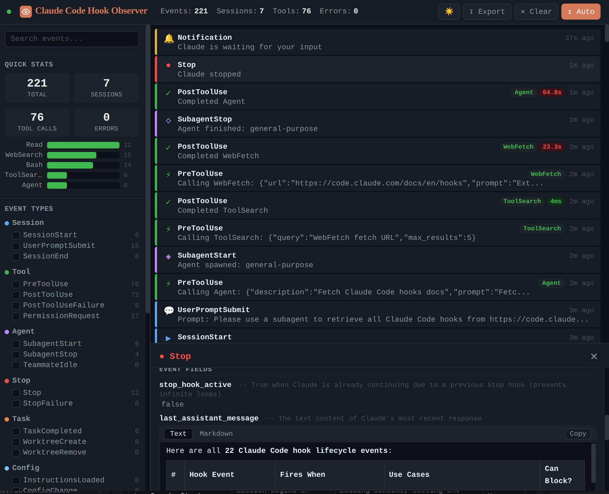

# Claude Code Hook Observer

A Claude Code plugin that monitors **all 22 hook events** and displays them in a real-time web dashboard.

Useful for debugging hooks, developing hook-based plugins, keeping history and learning how Claude Code works under the hood.

```bash
# Install the plugin
claude plugin marketplace add tomchen/claude-code-hook-observer
claude plugin install hook-observer@hook-observer-marketplace

# Start the dashboard server
node ~/.claude/plugins/cache/hook-observer-marketplace/hook-observer/1.0.0/server.js
```

Open http://localhost:7890 in your browser. Start a Claude Code session, events will appear in real-time.



## Features

- **All 22 hook events** captured: `SessionStart`, `UserPromptSubmit`, `PreToolUse`, `PostToolUse`, `PostToolUseFailure`, `PermissionRequest`, `Stop`, `StopFailure`, `SubagentStart`, `SubagentStop`, `TeammateIdle`, `TaskCompleted`, `WorktreeCreate`, `WorktreeRemove`, `InstructionsLoaded`, `ConfigChange`, `PreCompact`, `PostCompact`, `Elicitation`, `ElicitationResult`, `Notification`, `SessionEnd`
- **Real-time streaming**: Server-Sent Events (SSE), no manual refresh
- **Event timeline**: color-coded cards by category, tool duration tracking (`PreToolUse`/`PostToolUse` pairing)
- **Detail panel**: syntax-highlighted JSON, copyable values, markdown rendered as HTML, human-readable field descriptions
- **Filters**: by event type, tool name, session, and full-text search
- **Stats sidebar**: event counts, active sessions, error count, top tools chart
- **Dark/light theme**: persisted in browser
- **Export/clear** event data
- **Zero dependencies**: Node.js built-in modules only

## Configuration

| Flag | Default | Description |
|------|---------|-------------|
| `--port` | `7890` | Dashboard server port |
| `--data-dir` | `~/.claude/hook-observer-data` | Directory for event data storage |

Example:

```bash
node server.js --port 3000 --data-dir /tmp/hook-data
```

## Development

```bash
claude --plugin-dir /path/to/claude-code-hook-observer
```

This loads the plugin for a single session without installing it.

## Architecture

```
Claude Code hook event
        |
        v
scripts/hook-handler.js    Reads stdin JSON, adds metadata, appends to JSONL
        |
        v
~/.claude/hook-observer-data/events.jsonl
        |
        v
server.js                  Watches file, pushes new events via SSE
        |
        v
Browser dashboard          Renders timeline, filters, detail panel
```

- **hook-handler.js**: universal logger for 21 events. Reads JSON from stdin, enriches with `_observer` metadata (event_id, timestamp), appends to JSONL file. Exits 0 immediately.
- **worktree-handler.js**: `WorktreeCreate` passthrough. Logs the event, then runs `git worktree add` and prints the path to stdout.
- **server.js**: zero-dependency Node.js HTTP server. Serves the dashboard, REST API, and SSE endpoint.
- **public/index.html**: single-file dashboard with embedded CSS and JavaScript.

All hooks run with `async: true` (except `WorktreeCreate`) so they never slow down Claude Code.

## Supported Events

| Category | Event | Description |
|----------|-------|-------------|
| Session | `SessionStart` | Session begins or resumes |
| Session | `UserPromptSubmit` | User submits a prompt |
| Session | `SessionEnd` | Session terminates |
| Tool | `PreToolUse` | Before a tool call executes |
| Tool | `PostToolUse` | After a tool call succeeds |
| Tool | `PostToolUseFailure` | After a tool call fails |
| Tool | `PermissionRequest` | Permission dialog appears |
| Stop | `Stop` | Claude finishes responding |
| Stop | `StopFailure` | Turn ends due to API error |
| Agent | `SubagentStart` | Subagent is spawned |
| Agent | `SubagentStop` | Subagent finishes |
| Agent | `TeammateIdle` | Teammate about to go idle |
| Task | `TaskCompleted` | Task marked as completed |
| Task | `WorktreeCreate` | Worktree being created |
| Task | `WorktreeRemove` | Worktree being removed |
| Config | `InstructionsLoaded` | CLAUDE.md file loaded |
| Config | `ConfigChange` | Settings file changed |
| Config | `PreCompact` | Before context compaction |
| Config | `PostCompact` | After compaction completes |
| MCP | `Elicitation` | MCP server requests input |
| MCP | `ElicitationResult` | User responds to MCP input |
| Notification | `Notification` | Claude Code sends notification |

## License

MIT
